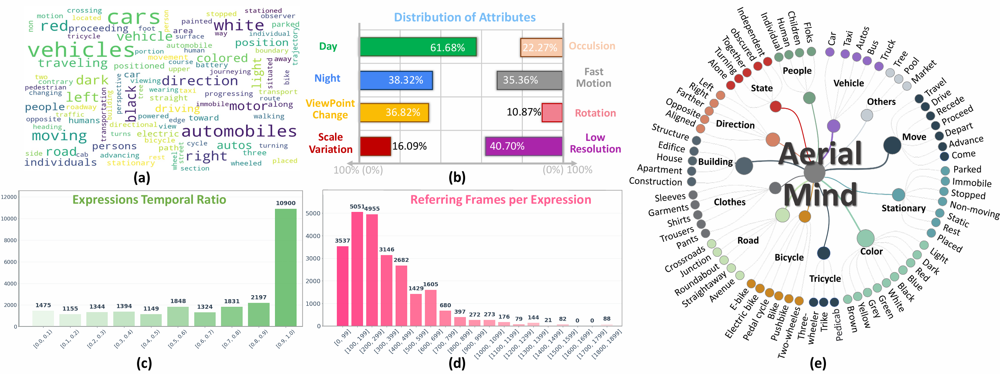
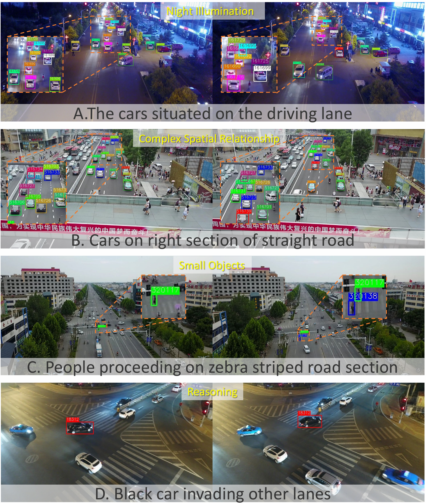

# AerialMind: Towards Referring Multi-Object Tracking in UAV Scenarios

This official repository of the paper [AerialMind: Towards Referring Multi-Object Tracking in UAV Scenarios](https://arxiv.org/abs/2511.21053). 
<div align=center></div>

## 📢 Latest Updates:

🔥🔥🔥**Dataset Now Publicly Available!**

Thank you everyone for your patience during the preparation phase. We are excited to announce that the dataset is now officially open for public use.

📥 **Baidu Netdisk:** [Baidu](https://pan.baidu.com/s/1gr15tk55UdYYitbKGh-puQ?pwd=869n)  
**Google Drive:** ⏳ *Upload in progress... (Links will be updated soon)*


## 💡 Building Your Own Dataset?
If you aim to construct a dataset similar to AerialMind, this repository [ **CRMOT**](https://github.com/chen-si-jia/CRMOT) serves as a comprehensive guide containing all the necessary resources and detailed pipeline information. We sincerely thank the authors for their contributions.

We referenced the [**RefDrone**](https://github.com/sunzc-sunny/refdrone) repository for the **COALA** methodology. We sincerely thank the authors for their contributions. We will release our core annotation tool (**Stage 2**) to facilitate future research.


# Dataset Features and Statistics
| Dataset        | Source       | Videos | Dom. | Reas. | Attr. | Expressions | Words | Instance / Expression | Instance | Annobbox  |
|----------------|--------------|--------|------|-------|-------|-------------|-------|-----------------------|----------|-----------|
| Refer-KITTI    | CVPR2023     | 18     | ✗    | ✗     | ✗     | 818         | 49    | 10.7                  | 8.8K     | 0.36M     |
| Refer-Dance    | CVPR2024     | 65     | ✗    | ✗     | ✗     | 1.9K        | 25    | 0.33                  | 650      | 0.55M     |
| Refer-KITTI-V2 | arXiv2024    | 21     | ✗    | ✗     | ✗     | 9.8K        | 617   | 6.7                   | 65.4K    | 3.06M     |
| Refer-UE-City  | arXiv2024    | 12     | ✗    | ✗     | ✗     | 714         | --    | 10.3                  | --       | 0.55M     |
| Refer-BDD      | IEEE TIM2025 | 50     | ✗    | ✗     | ✗     | 4.6K        | 225   | 14.1                  | 70.4K    | 1.50M     |
| CRTrack        | AAAI2025     | 41     | ✓    | ✗     | ✗     | 344         | 43    | --                    | --       | --        |
| LaMOT*         | IEEE ICRA2025| 62     | ✗    | ✗     | ✗     | 145         | 9     | **54.6**              | 508      | 1.2M      |
| AerialMind     | Ours         | **93** | ✓    | ✓     | ✓     | **24.6K**   | **1.2K** | 11.9              | **293.1K** | **46.14M** |

<div align=center></div>


# Results
## Visualization
<div align=center></div>

# Getting started
## Data Preparation
Put the tracking datasets in ./data. It should look like:
   ```
   ${PROJECT_ROOT}
    -- data
        --  AerialMind
            |-- Attribute
            |-- image_02
                 -- Visdrone
                 -- UAVDT
            |-- labels_with_ids
   ```

## Test Set Partition
### In-Domain (VisDrone):
`video_ids = ["uav0000009_03358_v", "uav0000073_00600_v", "uav0000073_04464_v", "uav0000077_00720_v", "uav0000088_00290_v", "uav0000119_02301_v", "uav0000120_04775_v", "uav0000161_00000_v", "uav0000188_00000_v", "uav0000201_00000_v", "uav0000249_00001_v", "uav0000249_02688_v", "uav0000297_00000_v", "uav0000297_02761_v", "uav0000306_00230_v", "uav0000355_00001_v", "uav0000370_00001_v"]`

### Cross-Domain(UAVDT):
`video_ids = ["M0203", "M0205", "M0209", "M0403", "M0701", "M0801", "M1001", "M1004", "M1007", "M1101", "M1301", "M1302", "M1401"]`

You can update the if __name__ == '__main__': block in the [inference.py ](https://github.com/wudongming97/RMOT/blob/master/inference.py) (e.g, TransRMOT) as follows:

```
if __name__ == '__main__':
    torch.multiprocessing.set_start_method('spawn')
    parser = argparse.ArgumentParser('DETR training and evaluation script', parents=[get_args_parser()])
    args = parser.parse_args()
    
    if args.output_dir:
        Path(args.output_dir).mkdir(parents=True, exist_ok=True)

    expressions_root = os.path.join(args.rmot_path, 'expression')
    
    if "KITTI" in args.rmot_path: 
        video_ids = ['0005', '0011', '0013', '0019']
    else: 
        # Add your target test set here (e.g., In-Domain)
        video_ids =  ["uav0000009_03358_v", "uav0000073_00600_v", "uav0000073_04464_v","uav0000077_00720_v", "uav0000088_00290_v", "uav0000119_02301_v", "uav0000120_04775_v", "uav0000161_00000_v", "uav0000188_00000_v", "uav0000201_00000_v", "uav0000249_00001_v", "uav0000249_02688_v", "uav0000297_00000_v", "uav0000297_02761_v", "uav0000306_00230_v", "uav0000355_00001_v", "uav0000370_00001_v"]
        #video_ids =  ["M0203", "M0205", "M0209","M0403", "M0701", "M0801", "M1001", "M1004", "M1007", "M1101", "M1301", "M1302", "M1401"]
```


# TODO List

- [ ] release the dataset [Train]
- [ ] release the dataset [Test]

# Acknowledgements

📢We would like to express our sincere gratitude to the authors and developers of [ **RMOT**](https://github.com/wudongming97/RMOT)、[ **TempRMOT**](https://github.com/zyn213/TempRMOT)、[ **CRMOT**](https://github.com/chen-si-jia/CRMOT)、[ **RefDrone**](https://github.com/sunzc-sunny/refdrone). Their repository provided valuable guidance and inspiration for the construction ([ **CRMOT**](https://github.com/chen-si-jia/CRMOT)、[ **RefDrone**](https://github.com/sunzc-sunny/refdrone)) of our dataset. 

We also thank the community for their interest in AerialMind.


